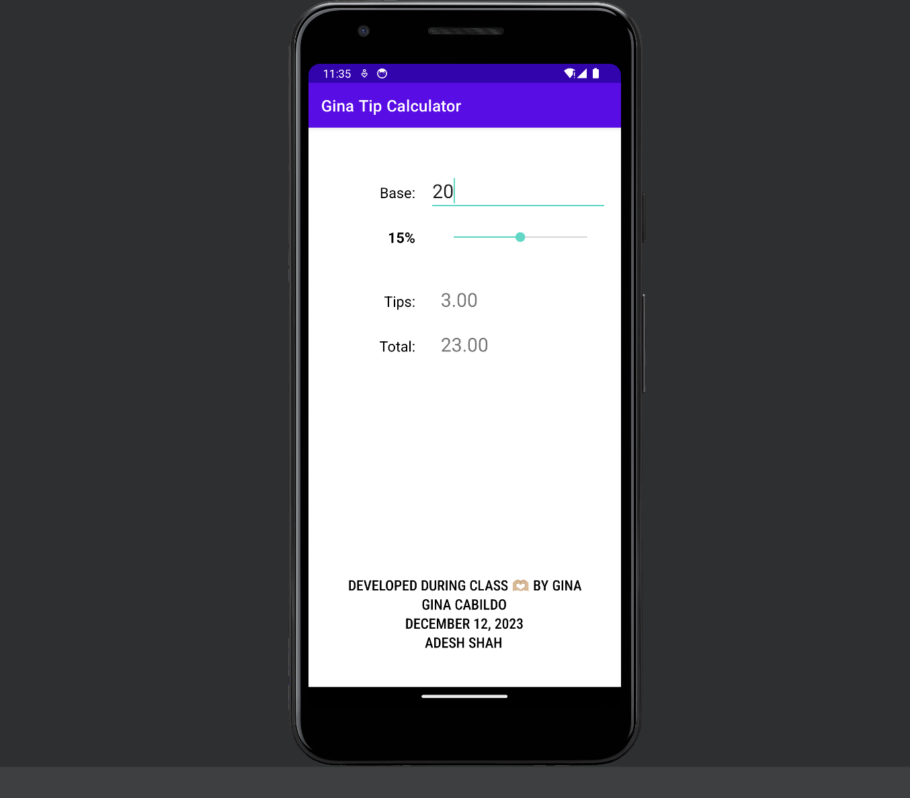
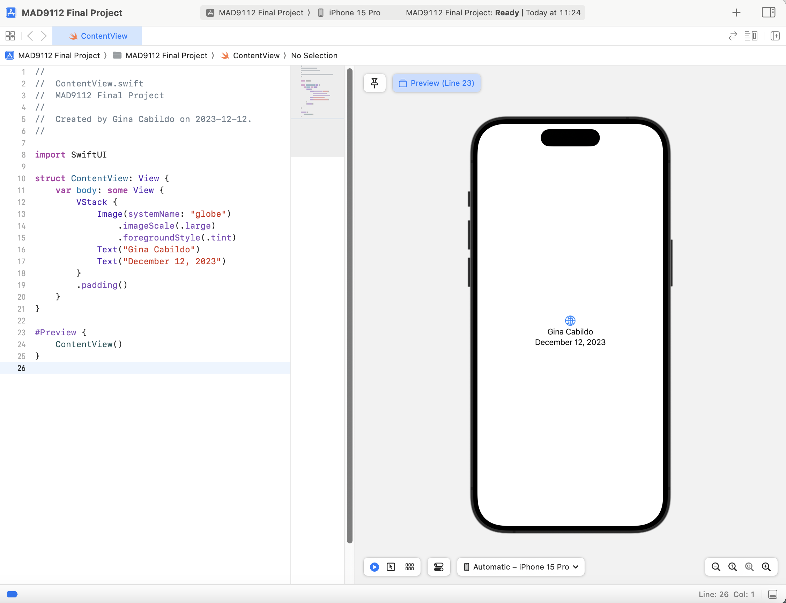
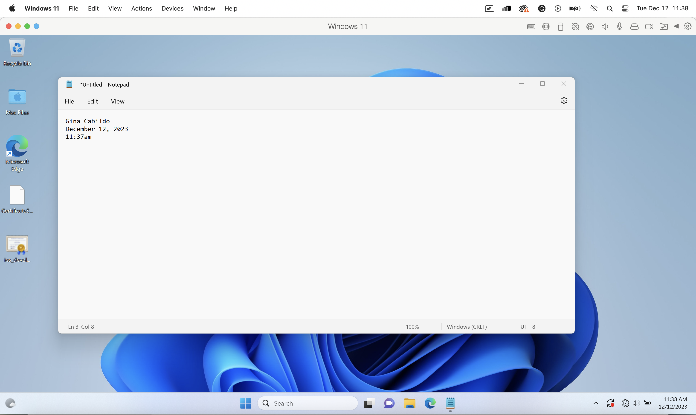

<h1>Gina_Cabildo_FinalProject</h1>

<code>
let date1 = new Date ("12/12/2023");

let date2 = new Date ("12/25/2023");

function getDaysUntilChristmas (date1, date2){
    
    let timeDifference = (date2-date1);
    console.log(date2-date1);
}

timeDifference = (date2-date1);

let daysDifference = timeDifference / (1000 * 3600 * 24);

let christmasCountdown = (Math.round(daysDifference));

console.log("There are " + christmasCountdown + " days before Christmas!");
</code>

